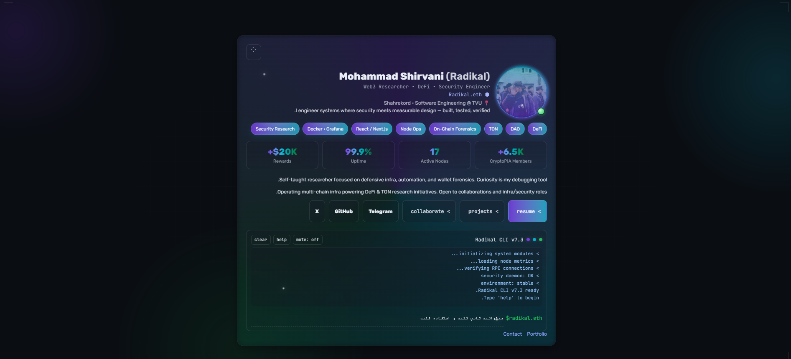

# Radikal Profile Card (v8.2 — Cyber-Minimal, redesigned)

**Author:** [Mohammad Shirvani (Radikal)](https://github.com/0xradikal)
**Demo:** <p align="center">
  
</p>

**License:** MIT

---

## 🧩 Overview

The **Radikal Profile Card** is a cyber‑minimal personal portfolio card built with pure **HTML, CSS, and JavaScript**, designed to showcase a developer or Web3 researcher profile in an interactive, accessible, and high‑performance format.

It’s built to be:

* **Fast:** No frameworks, no dependencies.
* **Accessible:** WCAG‑compliant and keyboard‑navigable.
* **Modular:** Fully theme‑aware (light/dark) and extendable.
* **Interactive:** Includes a custom command‑line interface (CLI) for fun user interaction.
* **Installable:** PWA + offline cache via Service Worker.

### What’s new in v8.2 (frontend / UI-UX / motion redesign)

A visual-layer-only redesign (no runtime logic, security, or data changed):

* **Design tokens + self-hosted fonts:** full token system (color/space/type/
  radius/elevation); Vazirmatn (fa/en) + JetBrains Mono (code) shipped locally
  as `woff2` with `unicode-range` — no font CDN, tighter CSP.
* **True RTL/LTR:** directional layout migrated to CSS logical properties so
  Persian (RTL) and English (LTR) both render correctly.
* **Calmer, accessible motion:** RAF+lerp card tilt, softened decorative
  animation, cross-document View Transitions — all respecting
  `prefers-reduced-motion`.
* **Cohesive, AA-compliant palette:** retired the old green-cyan/purple relic
  colors to the accent tokens; fixed the `Radikal.eth` link contrast (was
  1.84:1 on light, now ≥5:1).
* **PWA refresh:** Service Worker cache bumped so installed users get the new
  look; precache list verified complete.

### What’s new in v8.0

* Extended CLI (blog, skills, social, contact form, timeline, achievements, fetch, theme, easter‑egg).
* Command suggestions, tab auto‑complete, and persistent history.
* New pages: `blog.html`, `gallery.html`, `contact.html`, `timeline.html`, `skills.html`.
* Live GitHub stats, particles, 3D tilt, toast notifications, skeleton loaders.
* PWA manifest + Service Worker for offline read‑only experience.

---

## ⚙️ Project Structure

```
profile-card/
│
├── index.html              # Main HTML file (fa, dir=rtl)
├── profile-card.css        # Core styling (v8.2 — redesigned, tokenized)
├── index.js                # CLI logic (ES module; imports data/content.js)
├── favicon.svg             # Site icon (SVG)
├── manifest.json           # PWA manifest
├── sw.js                   # Service worker
│
├── data/
│   └── content.js          # SINGLE SOURCE OF TRUTH for blog/skills/timeline/gallery
├── pages/                  # External page modules (no inline scripts)
│   ├── theme.js            # Shared theme bootstrap (was duplicated inline)
│   ├── blog.js  skills.js  timeline.js  gallery.js  contact.js  projects.js
├── test/
│   ├── smoke.mjs           # Headless Playwright smoke test (npm test)
│   └── server.mjs          # Tiny static server (serves under /profile-card/)
│
├── blog.html  skills.html  timeline.html  gallery.html  contact.html  projects.html
├── en/                     # English mirrors (dir=ltr) of every page
│
├── plans/                  # improve-skill handoff plans (audit trail)
└── README.md               # Documentation (this file)
```

> **Architecture note:** all page content is defined once in `data/content.js`
> (locale-keyed for fa/en) and consumed by both the CLI (`index.js`) and the
> page modules under `pages/`. There are **no inline `<script>` blocks** — every
> page loads external ES modules under a strict CSP.

---

## 🚀 Quick Start

### 1. Clone the repository

```bash
git clone https://github.com/0xradikal/profile-card.git
cd profile-card
```

### 2. Open in browser

Because the site uses ES modules with absolute `/profile-card/` paths, serve it
(don't open `index.html` from `file://`). A local server is included:

```bash
npm install          # installs Playwright (dev-only, for tests)
npm run serve        # serves http://127.0.0.1:3000/profile-card/
```

### Running the tests

A headless smoke test guards the runtime contract (every DOM id the CLI needs),
asserts zero console errors, and checks there are **no CSP violations** across
all fa + en pages:

```bash
npm test             # → prints "SMOKE OK" on success
```

### Deployment (GitHub Pages)

1. Ensure the repo is hosted under `/profile-card/` path (or adjust links in `manifest.json` and Service Worker).
2. Build step is not required; deploy static files as-is.
3. Enable GitHub Pages (root of `main` branch). Assets are <100KB gzip.
4. PWA: keep `https` and scope `/profile-card/` for install prompt.

---

## 🎨 Customization Guide

### 1. **Profile Data**

Edit the following section in `index.html`:

```html
<h1 class="name">Your Name <span class="aka">(Alias)</span></h1>
<p class="role mono">Your Role • Skills</p>
<p class="ens mono">ENS or Handle</p>
<p class="meta">📍 Location • Your Position or Education</p>
```

### 2. **Badges & Stats**

Badges (`<section class="badges">`) define your expertise.
Stats (`<section class="stats">`) highlight measurable achievements.

### 3. **Theme & Colors**

All colors are defined in the `:root` of `profile-card.css`.
You can adjust brand gradients, panel opacity, or shadow depth.

```css
:root {
  --brandA: #7c3aed;
  --brandB: #06b6d4;
  --brandC: color-mix(in oklab, #16a34a 80%, #000 20%);
}
```

### 4. **Avatar**

Replace the avatar image:

```html

```

### 5. **CLI Commands**

Edit `index.js` → `files` map or add new commands inside the `handle()` switch.

```js
const files = new Map([
  ['resume',   '/profile-card/YourCV.pdf'],
  ['projects', '/profile-card/projects.html'],
]);
```

---

## 💻 CLI (Interactive Shell)

The embedded **Radikal CLI** lets users interact with your profile using typed commands.

### Available Commands

| Command            | Description                               |
| ------------------ | ----------------------------------------- |
| `help` or `h`      | Show available commands                   |
| `ls`               | List accessible files                     |
| `cat resume`       | Open resume / GitHub profile              |
| `cat projects`     | Open project list                         |
| `blog`             | List latest mock articles                 |
| `skills`           | Render skills with progress bars          |
| `social`           | Social links (GitHub/X/Telegram/LinkedIn) |
| `contact`          | Inline contact form with validation       |
| `timeline`         | Career timeline                           |
| `achievements`     | Badges & awards                           |
| `fetch <url>`      | Fetch JSON from a public API              |
| `theme dark|light` | Set theme via CLI                         |
| `easter-egg`       | Hidden surprise                           |
| `r` / `p`          | Shortcuts for resume / projects           |
| `whoami`           | Display profile summary                   |
| `status`           | Show node/infrastructure metrics          |
| `clear` / `c`      | Clear CLI output                          |

The terminal automatically stores command history (`localStorage`) and supports **arrow key navigation**.

---

## 🔊 Audio Feedback

Each keystroke and CLI event triggers a soft WebAudio tick for tactile feedback.

* Audio context initializes on the first user gesture.
* You can toggle sound with the **`mute`** button in the shell header.

To disable sound entirely, set:

```js
let muted = true;
```

---

## 🌗 Theme System

Theme switching is handled via the button in the top‑right corner.
It respects both **system preferences** and **manual user settings** stored in `localStorage`.

```js
const pref = localStorage.getItem('theme') || system;
document.documentElement.setAttribute('data-theme', pref);
```

---

## 📱 Responsive Design

The layout adapts from desktop (960px card) down to mobile (<480px):

* Two-column layout becomes vertical.
* Stats grid collapses to 1–2 columns.
* Buttons stack vertically.

All animations are **reduced** automatically when `prefers-reduced-motion` is enabled.

---

## 🧠 Accessibility (A11Y)

* Semantic HTML (`<header>`, `<section>`, `<footer>`)
* Screen-reader text via `.sr-only`
* ARIA labels and `aria-live` updates for CLI output
* Contrast‑safe colors under both themes

---

## 🧰 Browser Support

| Feature                        | Supported Browsers                 |
| ------------------------------ | ---------------------------------- |
| CSS color-mix / conic-gradient | Chrome 111+, Edge 111+, Safari 17+ |
| WebAudio API                   | All modern browsers                |
| LocalStorage / MatchMedia      | All modern browsers                |

Fallbacks are included for older Safari versions.

---

## 🧪 Developer Notes

* **No external dependencies.** All animations and effects are pure CSS or vanilla JS.
* **Performance:** Designed to stay <30KB gzip total (HTML+CSS+JS).
* **Security:** Zero inline scripts — all JS is external ES modules. Every page ships a strict `Content-Security-Policy` (`script-src 'self'`), verified by an automated smoke test.

---

## 🧩 Extending Functionality

You can extend the CLI to support new commands like `social`, `blog`, or `contact`:

```js
case 'social':
  printHTML(`X: <a href='https://x.com/yourhandle'>@yourhandle</a>`, 'ok');
  break;
```

Or add new UI sections to the HTML (e.g., achievements, timeline, portfolio grid).

---

## 🧠 Credits

Built and maintained by **[Mohammad Shirvani (Radikal)](https://github.com/0xradikal)**
Web3 Researcher & Security Engineer — DeFi • DAO • TON • NodeOps

---

## 📄 License

This project is licensed under the **MIT License** — free for personal and commercial use.

```text
MIT License
Copyright (c) 2025 Mohammad Shirvani (Radikal)

Permission is hereby granted, free of charge, to any person obtaining a copy
of this software and associated documentation files (the "Software"), to deal
in the Software without restriction, including without limitation the rights
to use, copy, modify, merge, publish, distribute, sublicense, and/or sell
copies of the Software, and to permit persons to whom the Software is
furnished to do so, subject to the following conditions:

THE SOFTWARE IS PROVIDED "AS IS", WITHOUT WARRANTY OF ANY KIND.
```
# کارت پروفایل Radikal (نسخه 8.0 — Cyber-Minimal)

**نویسنده:** [محمد شیروانی (Radikal)](https://github.com/0xradikal)
**دمو:** 
<p align="center">
  
</p>

**مجوز:** MIT

---

## 🧩 معرفی

کارت پروفایل **Radikal** یک کارت شخصی سایبر-مینیمال برای معرفی حرفه‌ای ساخته شده با **HTML، CSS و JavaScript خالص** است. هدف از آن نمایش هویت دیجیتال، رزومه و مهارت‌های شما به شکلی مدرن، سریع و قابل تعامل است.

ویژگی‌های کلیدی:

* **سریع و سبک:** بدون فریم‌ورک و وابستگی خارجی.
* **دسترس‌پذیر:** سازگار با WCAG و پشتیبانی کامل از کیبورد و صفحه‌خوان.
* **قابل توسعه:** پشتیبانی از حالت روشن/تاریک، CLI داخلی و ساختار ماژولار.
* **امن و سازگار:** بدون هیچ اسکریپت درون‌خطی (همهٔ JS به‌صورت ماژول خارجی)؛ هر صفحه یک `Content-Security-Policy` سخت‌گیرانه (`script-src 'self'`) دارد که با تست خودکار تأیید می‌شود.

---

## ⚙️ ساختار پروژه

```
profile-card/
│
├── index.html              # فایل اصلی HTML
├── profile-card.css        # استایل اصلی (v8.2 — بازطراحی‌شده)
├── index.js                # منطق JavaScript (تغییر تم + CLI)
├── favicon.svg             # آیکون سایت (SVG)
# (og:image اکنون به آواتار گیت‌هاب اشاره می‌کند)
├── projects.html           # صفحه پروژه‌ها (اختیاری)
└── README.md               # مستندات پروژه
```

---

## 🚀 شروع سریع

### ۱. کلون کردن ریپوزیتوری

```bash
git clone https://github.com/0xradikal/profile-card.git
cd profile-card
```

### ۲. اجرا در مرورگر

فایل `index.html` را مستقیماً باز کنید یا با یک سرور محلی اجرا کنید:

```bash
npx serve
```

سپس به آدرس زیر بروید:

```
http://localhost:3000
```

---

## 🎨 سفارشی‌سازی

### ۱. اطلاعات پروفایل

در بخش `<header>` فایل `index.html` ویرایش کنید:

```html
<h1 class="name">نام شما <span class="aka">(نام مستعار)</span></h1>
<p class="role mono">نقش یا تخصص شما • مهارت‌ها</p>
<p class="ens mono">آدرس ENS یا شناسه کاربری</p>
<p class="meta">📍 موقعیت مکانی • موقعیت تحصیلی یا شغلی</p>
```

### ۲. برچسب‌ها و آمار

در بخش `<section class="badges">` مهارت‌ها را وارد کنید و در `<section class="stats">` شاخص‌های عددی مثل اعضای کامیونیتی یا Uptime را تنظیم کنید.

### ۳. رنگ‌ها و تم

در `:root` فایل CSS رنگ‌های برند را تنظیم کنید:

```css
:root {
  --brandA: #7c3aed;
  --brandB: #06b6d4;
  --brandC: color-mix(in oklab, #16a34a 80%, #000 20%);
}
```

### ۴. آواتار

آدرس تصویر پروفایل را تغییر دهید:

```html

```

### ۵. دستورات CLI

در فایل `index.js` قسمت `files` یا تابع `handle()` را ویرایش کنید تا مسیرهای شخصی خود را اضافه کنید:

```js
const files = new Map([
  ['resume',   '/profile-card/YourCV.pdf'],
  ['projects', '/profile-card/projects.html'],
]);
```

---

## 💻 ترمینال تعاملی (CLI)

ترمینال داخلی یا **Radikal CLI** امکان تعامل با پروفایل را از طریق دستورات متنی فراهم می‌کند.

### دستورات موجود

| دستور              | توضیح                              |
| ------------------ | ---------------------------------- |
| `help` یا `h`      | نمایش لیست دستورات                 |
| `ls`               | فهرست فایل‌ها                      |
| `cat resume`       | باز کردن رزومه / پروفایل گیت‌هاب   |
| `cat projects`     | باز کردن صفحه پروژه‌ها             |
| `blog`             | نمایش لیست مقالات                  |
| `skills`           | مهارت‌ها به صورت progress bar      |
| `social`           | لینک شبکه‌های اجتماعی              |
| `contact`          | فرم تماس درون ترمینال              |
| `timeline`         | رویدادهای شغلی                     |
| `achievements`     | نشان‌ها و جوایز                    |
| `fetch <url>`      | دریافت JSON از API                 |
| `theme dark|light` | تغییر تم از CLI                    |
| `easter-egg`       | ایستر اگ                          |
| `r` / `p`          | میان‌بر رزومه / پروژه‌ها           |
| `whoami`           | نمایش اطلاعات کاربر                |
| `status`           | نمایش وضعیت نودها و پاداش‌ها       |
| `clear` یا `c`     | پاک‌کردن خروجی ترمینال             |

دستورات ذخیره می‌شوند و با کلیدهای جهت‌نما (↑↓) قابل مرورند.

---

## 🔊 صدای بازخورد

برای هر رویداد ورودی یا دستور، یک صدای کوتاه از طریق WebAudio پخش می‌شود.
می‌توانید صدا را از دکمه **mute** در بالای ترمینال خاموش کنید.

برای غیرفعال کردن کامل صدا:

```js
let muted = true;
```

---

## 🌗 سیستم تم

سیستم تم به‌صورت خودکار با حالت سیستم کاربر همگام است و انتخاب کاربر در `localStorage` ذخیره می‌شود.

```js
const pref = localStorage.getItem('theme') || system;
document.documentElement.setAttribute('data-theme', pref);
```

---

## 📱 واکنش‌گرایی

طراحی کارت از دسکتاپ (960px) تا موبایل (<480px) به‌صورت خودکار تنظیم می‌شود:

* ساختار دو ستونه به تک‌ستونه تبدیل می‌شود.
* شبکه آمار از ۴ ستون به ۲ یا ۱ ستون کاهش می‌یابد.
* دکمه‌ها در موبایل تمام عرض می‌شوند.

همچنین برای کاربران با `prefers-reduced-motion` انیمیشن‌ها کاهش می‌یابند.

---

## 🧠 دسترس‌پذیری

* استفاده از تگ‌های معنایی (`header`, `section`, `footer`)
* پشتیبانی از صفحه‌خوان با `.sr-only`
* تنظیمات ARIA برای وضعیت ترمینال
* رنگ‌های سازگار با WCAG AA در هر دو تم

---

## 🧰 پشتیبانی مرورگرها

| ویژگی                      | مرورگرهای پشتیبانی‌شده             |
| -------------------------- | ---------------------------------- |
| color-mix / conic-gradient | Chrome 111+, Edge 111+, Safari 17+ |
| WebAudio API               | تمامی مرورگرهای مدرن               |
| LocalStorage / MatchMedia  | تمامی مرورگرهای مدرن               |

برای Safari قدیمی fallback رنگ در نظر گرفته شده است.

---

## 🧩 نکات توسعه‌دهنده

* بدون هیچ وابستگی خارجی.
* طراحی‌شده برای حجم کمتر از ۳۰ کیلوبایت gzip.
* دارای Content Security Policy سخت‌گیرانه روی همهٔ صفحات (بدون اسکریپت درون‌خطی).

---

## 🔧 گسترش عملکرد

می‌توانید فرمان‌های جدید مثل `social` یا `contact` اضافه کنید:

```js
case 'social':
  printHTML(`X: <a href='https://x.com/yourhandle'>@yourhandle</a>`, 'ok');
  break;
```

یا بخش‌های جدید به HTML بیفزایید (مثل سوابق، تایم‌لاین یا نمونه‌کارها).

---

## 👨‍💻 سازنده

طراحی و توسعه توسط **[محمد شیروانی (Radikal)](https://github.com/0xradikal)**
پژوهشگر Web3 و مهندس امنیت — DeFi • DAO • TON • NodeOps

---

## 📄 مجوز

این پروژه تحت مجوز **MIT** آزاد است — برای استفاده شخصی و تجاری.

```text
MIT License
Copyright (c) 2025 Mohammad Shirvani (Radikal)

Permission is hereby granted, free of charge, to any person obtaining a copy
of this software and associated documentation files (the "Software"), to deal
in the Software without restriction, including without limitation the rights
to use, copy, modify, merge, publish, distribute, sublicense, and/or sell
copies of the Software, and to permit persons to whom the Software is
furnished to do so, subject to the following conditions:

THE SOFTWARE IS PROVIDED "AS IS", WITHOUT WARRANTY OF ANY KIND.
```
